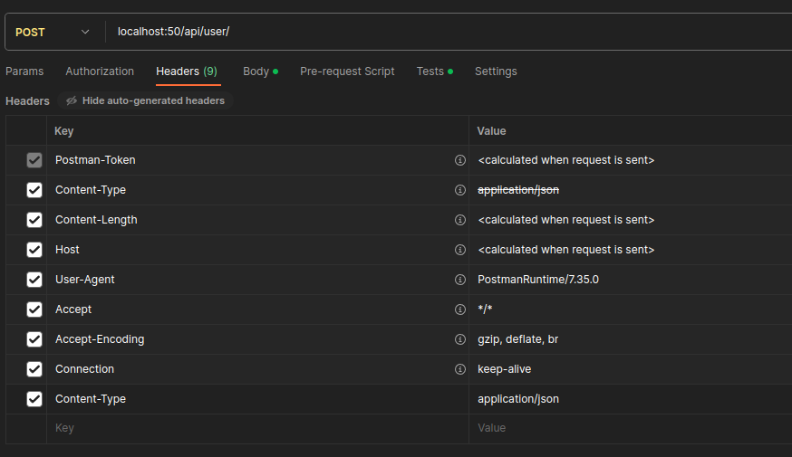

Projekt uruchomił na Docker: Yehor Voznyi 40260

Mam 2 kontenery: daze danych - db, i backend - flask i db
powiązane między sabą przez volume

proszę uruchomić "docker pull esolang/sqlite3"
oraz plik docker-compose.yml 

przykład testu za pomocą postman`a

